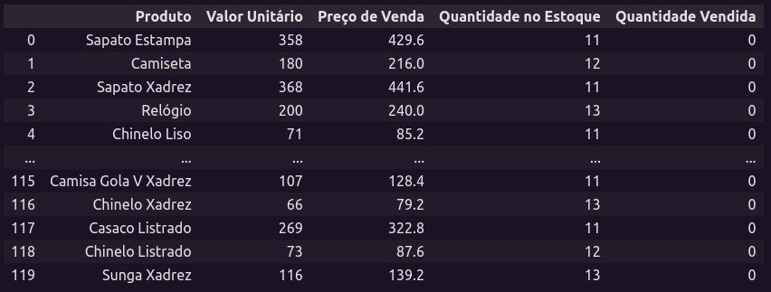

# Vendas de uma empresa

O projeto de vendas de uma empresa tem como objetivo organizar e analisar os produtos de uma empresa com base nas quantidades que foram vendidas, além disso tem o valor unitário, preço de venda e a quantidade no estoque e que podem ser manipulados com as seguintes funções escritas no tópico de funcionalidades.

## Funcionalidades

<ul>
    <li>Vender produto</li>
    <li>Visualizar a quantidade total de produtos vendidos</li>
    <li>Visualizar dinheiro total recebido </li>
    <li>Visualizar lucro total</li>
    <li>Repor estoque</li>
    <li>Visualizar o produto mais vendido</li>
    <li>Visualizar o produto menos vendido</li>
</ul>

## Autores 

Evellyn Rodrigues da Rocha

Lara Fernanda Amorim Alves Cavalcante
